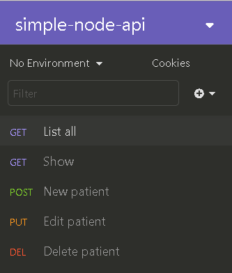
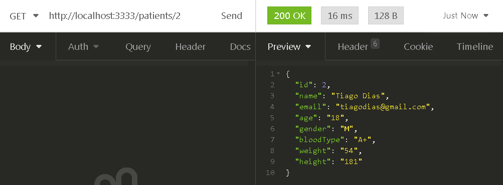

# Simple Node API
Essa foi a minha primeira API que desenvolvi sozinho, que basicamente, pode salvar, editar, mostrar e excluir dados de pacientes de um possível sistema para um hospital ou algo parecido, você pode ler mais detalhes sobre ela logo abaixo :arrow_heading_down:

## Tecnologias utilizadas :rocket:

 - [NodeJS](https://nodejs.org/pt-br/) utilizando o framework [Express](https://expressjs.com/pt-br/)
 - Módulo de File System do Node para poder salvar os dados em um arquivo JSON

## Objetivo do projeto :dart:

Eu desenvolvi essa API com o objetivo de praticar e fixar meus conhecimentos em Node.js, e também, para mim foi um desafio desenvolvê-la, visto que essa é uma das minhas primeiras APIs, e é a primeira que desenvolvi sozinho!
   
## Como testar a API em sua máquina :arrow_forward:

Para utilizá-la, você precisará instalar em seu computador o [Git](https://git-scm.com), o [Node.JS/NPM](https://nodejs.org/en/) e algum software que possa testar APIs, eu recomendo o [Insomnia](https://insomnia.rest/download/) pois ele é muito fácil de se usar, simples e eficaz, baixe a versão Insomnia Core!

Passo a passo para testar a aplicação:
1. Vá em algum diretório do seu computador, e abra o Git Bash clicando com o botão direito do mouse no diretório que você escolheu, e escolha a opção "Git Bash Here", após isso siga os seguintes passos:

### Baixando o projeto
```bash
# Clone o repositório
$ git clone https://github.com/TiagoDiass/simple-node-api.git

# Entre na pasta do repositório
$ cd simple-node-api
```

2. Após isso, você pode instalar as dependências da API e então iniciá-la seguindo os seguintes passos

### Instalando as dependências e iniciando a API
```bash
# Instale as dependências
$ npm install 

# Após ter instalado, inicie a aplicação
$ npm start
```

3. Abra o Insomnia e siga estes passos:

      - Para testar a API no Insomnia, você pode começar criando um workspace clicando na setinha branca ao lado do nome do seu workspace atual, e dar a ele o nome que você quiser, nesse caso eu coloquei simple-node-api pois é o nome do repositório.

      - Após isso você pode criar as requests, seguindo os seguintes passos, caso queira trocar o nome de alguma delas você pode, o importante é que você preste atenção ao método HTTP que está dando ao criar cada uma das requests, se baseie nos metódos que estão a esquerda dos nomes das requisições no print abaixo :arrow_heading_down:
      
      
      
      - <strong>Observação:</strong> Na criação das requisições "New patient" e "Edit patient", ao lado do método você terá um campo com as opções para o corpo da requisição, escolha a opção <strong>"Form URL Encoded"</strong>, isso acontece porque os métodos POST e PUT recebem dados para realizar uma determinada ação, logo, para receber os dados precisamos enviá-los através do corpo da requisição/request.
      
      - Após criar todas as requests como no print acima, coloque essas rotas para cada uma das requisições :arrow_heading_down:
      
- Requisição List all<br>
    Método GET<br>
    Rota da requisição: http://localhost:3333
    
- Requisição Show(que nos mostrará um paciente especifício)<br>
    Método GET<br>
    Rota da requisição: http://localhost:3333/patients/id <br> (<strong>Obs:</strong> substitua o "id"  pelo ID do paciente que você deseja ver)
    
- Requisição New patient<br>
  Método POST<br>
  Rota da requisição: http://localhost:3333/patients/new
  
- Requisição Edit patient<br>
  Método PUT<br>
  Rota da requisição: http://localhost:3333/patients/id <br>
  (<strong>Obs:</strong> substitua o "id"  pelo ID do paciente que você deseja editar)
  
- Requisição Delete patient<br>
  Método DELETE<br>
  Rota da requição: http://localhost:3333/patients/id <br>
  (<strong>Obs:</strong> substitua o "id"  pelo ID do paciente que você deseja excluir)
  
  
## Testando a API :on:

Após ter criado todas as requisições, você pode começar a testá-la, o funcionamento dela é bem simples, através das requisições, você pode salvar, editar, mostrar e excluir dados de pacientes de um possível sistema para um hospital ou algo do tipo.

### Requisição List all: 

Como o nome da requisição já diz, ela irá listar todos os registros dos pacientes que estão no arquivo data.json, esse é o resultado ao executá-la(ah, e para executá-la, basta clicar no botão SEND, isso irá enviar a requisição para API) :arrow_heading_down:


### Requisição Show: 

Essa requisição irá mostrar os dados de um paciente específico, para utilizá-la você deve colocar o ID do paciente que você deseja ver os dados na rota/endereço da requisição, como na imagem abaixo, que também nos mostra o resultado final da requisição :arrow_heading_down:




### Requisição New Patient: 

Essa é a requisição responsável por adicionar um novo paciente aos registros, para utilizá-la você deve preencher o corpo da requisição com os seguintes dados: name, email, age, gender, bloodType, weight e height.
Você pode seguir o exemplo na imagem abaixo, após adicionar o paciente, a resposta da requisição será os dados do paciente que você adicionou, veja abaixo :arrow_heading_down:


### Requisição Edit Patient: 

Essa é a requisição responsável por editar os dados de um paciente, para utilizá-la você deve colocar o nome do dado que deseja alterar e seu respectivo valor, não se esqueça que o nome dos dados não podem ser diferente de: name, email, age, gender, bloodType, weight ou height.
Você pode seguir o exemplo na imagem abaixo, após editar o paciente, a resposta da requisição serão os novos dados do paciente que você editou, veja abaixo :arrow_heading_down:


### Requisição Delete Patient: 

Essa é a requisição responsável por deletar um paciente, o resultado da requisição serão todos os pacientes, ou seja, todos os pacientes menos o que você excluiu, para se certificar que o paciente foi excluido você pode executar a request List All para ver todos os pacientes novamente, e para utilizar a requisição "Delete Patient" você deve colocar o ID do paciente na rota como na imagem abaixo :arrow_heading_down:


<hr>

### Como parar a aplicação:

Após ter utilizado ela, você pode parar o seu funcionamento abrindo o terminal Git Bash que você utilizou para iniciar a API, e apertar <kbd>CTRL</kbd>+<kbd>C</kbd>, após isso a API será parada e você não conseguirá mais utilizá-la enquanto você não iniciá-la novamente :)
